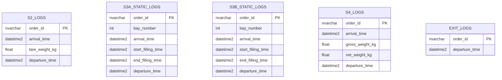

# Database Documentation

## Schema



---

## S2_LOGS

One row per truck passing through station S2.

| Column | Type | Source PLC Tag | Notes |
|---|---|---|---|
| `order_id` | nvarchar | `PLC_PRG.S2po` | PO number from PLC |
| `arrival_time` | datetime2 | `PLC_PRG.EntryTime_S2` | Unix timestamp (seconds) → converted to datetime |
| `tare_weight_kg` | float | `PLC_PRG.WT_001` | Raw value in grams ÷ 1000 |
| `departure_time` | datetime2 | `PLC_PRG.ExitTime_S2` | Unix timestamp (seconds) → converted to datetime |

### PLC Payload (S2_plc device)

All 4 tags arrive in a single event inside the `values` array:

```json
{
  "values": [
    { "id": "Channel3.LAPTOP-38PB18VI.Application.PLC_PRG.ExitTime_S2",  "v": 1778340485 },
    { "id": "Channel3.LAPTOP-38PB18VI.Application.PLC_PRG.EntryTime_S2", "v": 1778340478 },
    { "id": "Channel3.LAPTOP-38PB18VI.Application.PLC_PRG.WT_001",       "v": 15400 },
    { "id": "Channel3.LAPTOP-38PB18VI.Application.PLC_PRG.S2po",         "v": "40485" }
  ],
  "IoTHub": { "ConnectionDeviceId": "S2_plc" }
}
```

### Stream Analytics Query

- **Input:** `[fimih-hub]`
- **Output:** `[mp-sql-db-1-0-1-S2-logs]`

```sql
SELECT
    hub.IoTHub.ConnectionDeviceId                                                   AS device_id,
    CAST(po.ArrayValue.[v] AS nvarchar(max))                                        AS order_id,
    DATEADD(second, CAST(entry.ArrayValue.[v] AS bigint), '1970-01-01T00:00:00Z')  AS arrival_time,
    CAST(wt.ArrayValue.[v] AS float) / 1000.0                                       AS tare_weight_kg,
    DATEADD(second, CAST(exit_.ArrayValue.[v] AS bigint), '1970-01-01T00:00:00Z')  AS departure_time
INTO
    [mp-sql-db-1-0-1-S2-logs]
FROM
    [fimih-hub] AS hub
CROSS APPLY GetArrayElements(hub.[values]) AS po
CROSS APPLY GetArrayElements(hub.[values]) AS entry
CROSS APPLY GetArrayElements(hub.[values]) AS wt
CROSS APPLY GetArrayElements(hub.[values]) AS exit_
WHERE
    hub.IoTHub.ConnectionDeviceId = 'S2_plc'
    AND po.ArrayValue.[id]    LIKE '%S2po%'
    AND entry.ArrayValue.[id] LIKE '%EntryTime_S2%'
    AND wt.ArrayValue.[id]    LIKE '%WT_001%'
    AND exit_.ArrayValue.[id] LIKE '%ExitTime_S2%'
```

---

## TODO — Other Stations

S3A, S3B, S4, and EXIT tables are defined in the schema but not yet implemented.
